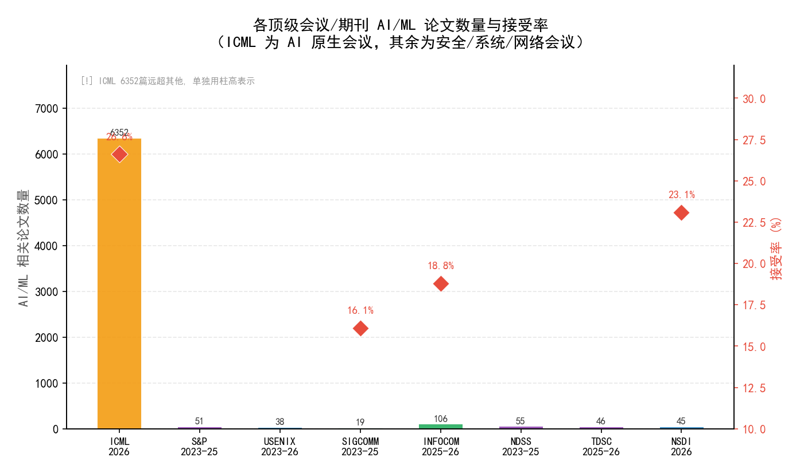
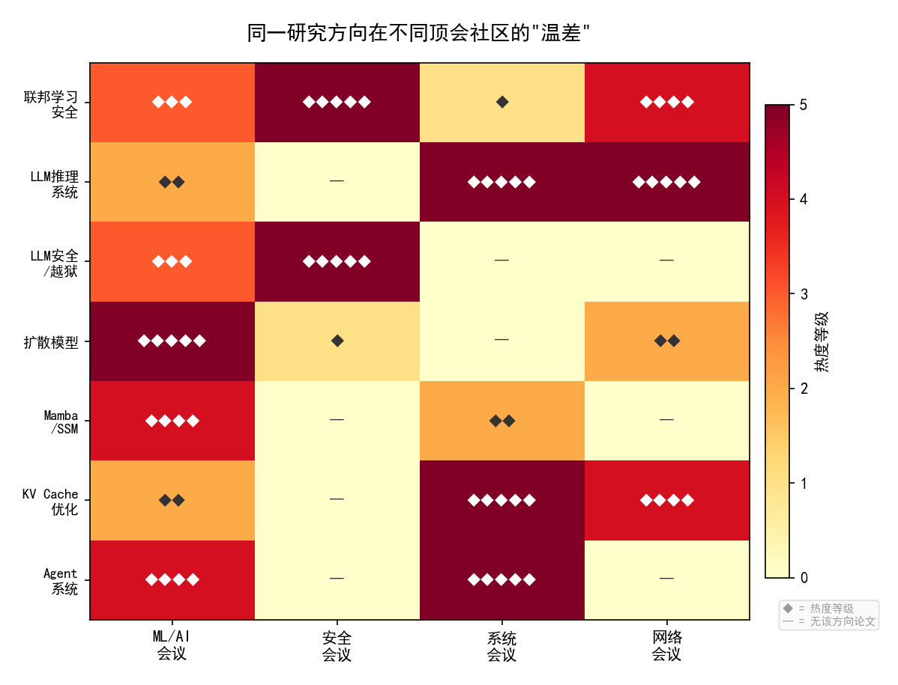
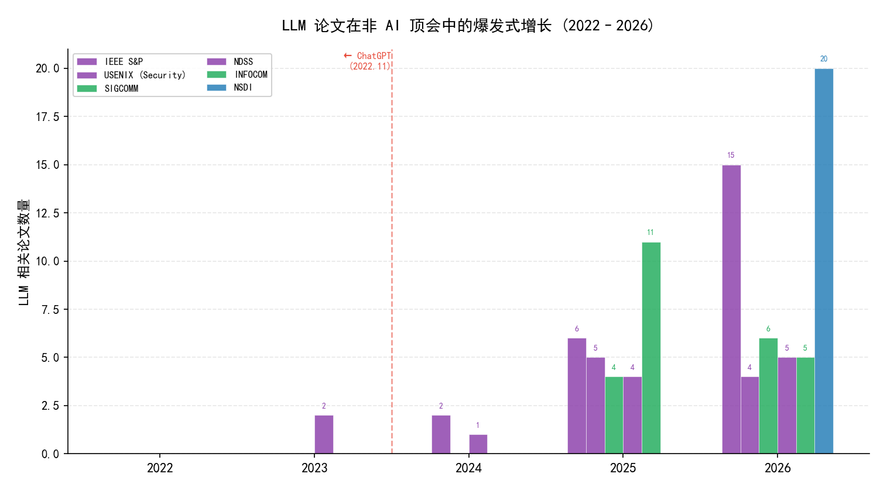
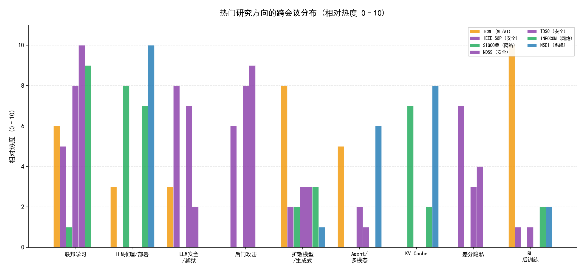

# 当 LLM 吞噬一切：2023–2026 AI 研究全景观察

> *LLM is not a sub-field of AI. LLM is an era of AI.*

基于 **9 大顶级会议/期刊**、**500+ 篇论文** 的跨领域趋势分析，揭示 2023–2026 年间大语言模型如何重塑计算机科学的每一个子领域。

---

## 数据可视化

### 1. 各顶会 AI/ML 论文数量与接受率



ICML 作为 AI 原生会议接受了 6,352 篇论文（26.6% 接受率），远超其他非 AI 顶会。但在安全、系统、网络会议上，AI/ML 论文的**增速**惊人。

### 2. 跨领域「温差」现象



同一研究方向在不同社区的热度差异巨大。例如：KV Cache 优化在系统和网络会议中是核心议题（5 级热度），但在 ML 和安全会议中几乎不存在。

### 3. LLM 论文在非 AI 顶会中的爆发曲线



以 ChatGPT 发布（2022.11）为分水岭，LLM 论文在安全（S&P）、网络（SIGCOMM）、系统（NSDI）等非 AI 顶会中呈**指数级**增长。IEEE S&P 从 2023 年的 0 篇增长到 2025 年的 15 篇。

### 4. 热门研究方向跨会议分布



- **联邦学习**：在 TDSC 和 NDSS 中最热，ICML 和 INFOCOM 紧随其后
- **LLM 推理系统**：NSDI 和 INFOCOM 的绝对主场
- **LLM 安全/越狱**：仅存在于安全会议——这是一个「社区隔离」方向
- **后门攻击**：TDSC 和 NDSS 最活跃，ICML 几乎不涉及

---

## 数据来源

| 会议/期刊 | 类型 | 覆盖时间 | 论文数量 | 备注 |
|-----------|------|----------|---------|------|
| **ICML** | ML/AI | 2026 | 23,918 投稿 / 6,352 接收 | 录取率 26.6% |
| **IEEE S&P** | 安全 | 2023–2025 | 50+ AI 论文 | LLM Security 首次独立 session |
| **USENIX 系列** | 系统/安全 | 2023–2026 | ~40 AI 论文 | Security, OSDI, ATC, NSDI |
| **SIGCOMM** | 网络 | 2023–2025 | 19 AI 论文 | 74/461 (16.1%) |
| **INFOCOM** | 网络 | 2025–2026 | 601 篇 / 106 AI 论文 | 272/1458 (2025), 329/1740 (2026) |
| **NDSS** | 安全 | 2023–2025 | 55+ AI 论文 | |
| **TDSC** | 安全期刊 | 2025–2026 | 46+ AI 论文 | 联邦学习 15+ 篇 |
| **NSDI** | 系统 | 2026 | 150 / 45 AI | Spring 50/207, Fall 100/452 |

---

## 核心发现摘要

### LLM 吞噬一切

LLM 不再是 AI 的一个子方向——它是 AI 的一个时代。它改变了：
- **安全的攻击面**：从 DNN 到 LLM（越狱、提示注入、应用商店安全）
- **网络的瓶颈**：从带宽到 GPU 通信（KV Cache 传输、all-to-all 通信调度）
- **系统的优化目标**：从吞吐量到 TTFT/TPOT（chunked-prefill、MoE 解耦训练）

### 架构之争三足鼎立

| 阵营 | 代表 | 关键事件 |
|------|------|----------|
| **扩散语言模型** | dLLM, MDLM | ICML 2026 包揽两项杰出论文奖 |
| **SSM/Mamba/RWKV** | Mamba-3, RWKV-7 | ICLR 2026 Oral, 尚未渗透到安全/网络会议 |
| **Transformer** | GPT-4, Llama | 仍占统治地位, 但不再是唯一答案 |

### CNN/LSTM 退场

在 NDSS、S&P、USENIX、SIGCOMM、NSDI 的论文标题中，CNN/RNN/LSTM 的出现次数趋近于 **零**。它们没有死，但不再是论文的「卖点」。

### 强化学习的华丽转身

RL 以 **886 篇论文** 成为 ICML 2026 第一大方向。驱动力：**RL 成为 LLM 后训练的标准范式**（PPO → DPO → GRPO → GSPO → POPO → GOPO）。

### 安全的三重迁移

1. **从模型安全 → 生态安全**：攻击面从 DNN 扩展到 LLM 应用商店、训练数据供应链
2. **从数字域 → 物理域**：自动驾驶对抗补丁、助听器语音攻击
3. **从经验性 → 理论化**：ICML 2026 发现「表面安全对齐」现象

### 中国在基础设施层的集群效应

SIGCOMM 2025 和 NSDI 2026 上，LLM 基础设施论文密集来自清华、北大、南大、阿里云、华为、蚂蚁——**从芯片到网络到系统的完整研究栈**正在形成。

---

## 编译 LaTeX 文档

```bash
# 需要 XeLaTeX (TeX Live 或 MiKTeX)
xelatex AI_research_landscape_2023_2026.tex
xelatex AI_research_landscape_2023_2026.tex  # 第二遍交叉引用
```

前置依赖：`ctexart` 文档类（含中文字体支持）。

---

## 仓库结构

```
when-llm-devours-everything/
├── README.md                                    ← 本文件
├── AI_research_landscape_2023_2026.tex          ← LaTeX 源文件
├── AI_research_landscape_2023_2026.pdf          ← 编译好的报告
├── generate_charts.py                           ← 图表生成脚本
├── chart1_venue_overview.png                    ← 图1
├── chart2_temperature_heatmap.png               ← 图2
├── chart3_llm_growth.png                        ← 图3
├── chart4_topic_distribution.png                ← 图4
├── NDSS_papers/                                 ← NDSS 论文分析
├── acm_paper_scraper/                           ← ACM 爬虫 + 数据
├── ieee_sp_papers/                              ← IEEE S&P 论文分析
├── infocom_papers/                              ← INFOCOM 论文分析 + 爬虫
├── nsdi26_papers/                               ← NSDI 2026 分析
├── sigcomm_papers/                              ← SIGCOMM 论文分析
├── tdsc_papers/                                 ← TDSC 论文分析
├── usenix_papers/                               ← USENIX 论文分析
└── 论文爬取/                                     ← ICML 研究方向总结
```

---

## 图表生成

```bash
pip install matplotlib numpy
python generate_charts.py
```

---

## 许可与引用

如果你觉得这份分析对你有帮助，欢迎 Star ⭐ 和引用本仓库。

```bibtex
@misc{when-llm-devours-everything,
  title   = {当 LLM 吞噬一切: 2023--2026 AI 研究全景观察},
  author  = {lxy3837},
  year    = {2026},
  url     = {https://github.com/lxy3837/when-llm-devours-everything}
}
```

---

*最后更新: 2026-07-16*
